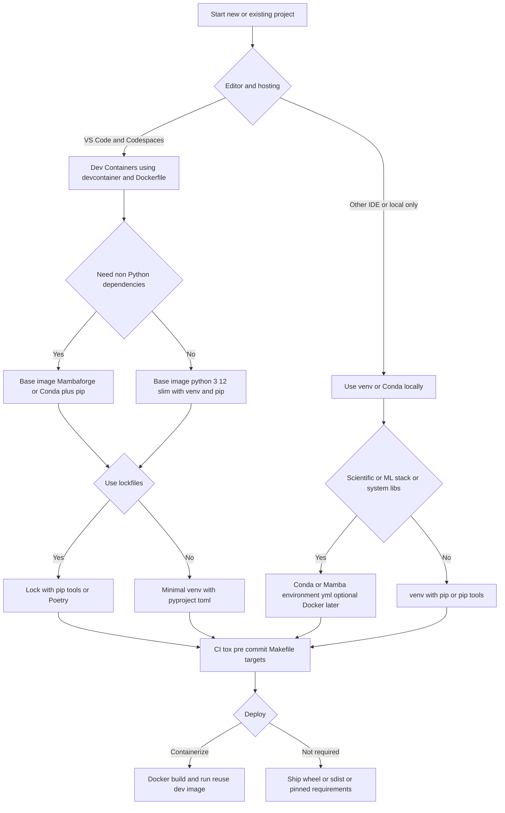

# reproducible-dev-environments

This README contains a **Reproducible Environment Glossary** for technologies and major patterns related to creating and mainining dev environments.  These patterns are compared and contrasted in terms of age, adoption, appropriateness, and best practice.

The repository itself contains a default pattern discussed below based on the devcontainer pattern Default_datascience_devcontainer.

The .github/prompt directory contains prompts that can be used to generate this default (00_Default_datascience_devcontainer) as well as alternative setup patterns.

---
# This repository - a Datascience/LLM Reproducible Scaffold

Reproducible dev via **devcontainer + venv + pip-tools**. Designed for **GitHub Codespaces** and portable to other clouds.

## Quickstart (Codespaces)

1. Open in Codespaces; the devcontainer builds automatically.
2. Dependencies are compiled & installed via `make bootstrap` (triggered by `postCreateCommand`).
3. Run tests: `make test`
4. Lint & type-check: `make lint`
5. Start API: `make run` then open <http://localhost:8000/healthz>

## Dependency Workflow

- Add a dependency to `requirements.in` (or `requirements-dev.in`).
- Rebuild lock files: `make lock`
- Sync the environment: `make sync`
- Commit: `requirements.in`, `requirements-dev.in`, and then the lock files that get made by `make lock` (requirements.txt and requirements-dev.txt) once they have been validated.
- This makes a determinative build for the next person checking out your code and trying to reproduce your work.


---

# 📘 Reproducible Environment Glossary

### **Core Environment Managers**

* **venv**
  Built-in Python module for creating **lightweight virtual environments** with their own site-packages. Replaces the older `virtualenv`.
  📖 [Python docs](https://docs.python.org/3/library/venv.html)

* **virtualenv**
  Third-party tool that pre-dates `venv`. Still used for backward compatibility or advanced options not in `venv`.
  📖 [Virtualenv docs](https://virtualenv.pypa.io/en/latest/)

* **conda**
  General-purpose environment and package manager from Anaconda. Handles **Python and non-Python dependencies** (C libraries, R, CUDA). Supports environment YAML files for reproducibility.
  📖 [Conda docs](https://docs.conda.io/en/latest/)

* **mamba**
  Mamba is a faster, re-implemented, drop-in replacement for the Conda package solver. Mambaforge is a distribution that bundles Mamba. See also [MiniForge](https://github.com/conda-forge/miniforge).


### **Dependency & Build Specification**

* **requirements.txt**
  Flat list of dependencies (optionally with pinned versions). Standard in many projects but **does not capture build system metadata**.
  📖 [Pip requirements](https://pip.pypa.io/en/stable/reference/requirements-file-format/)

* **setup.py**
  Traditional Python packaging entrypoint. Used by `setuptools` to define metadata and dependencies.
  📖 [Setuptools setup.py](https://setuptools.pypa.io/en/latest/userguide/declarative_config.html)

* **pyproject.toml (PEP 518)**
  Modern build system configuration file. Declares build requirements and project metadata. Encouraged over `setup.py`.
  📖 [PEP 518](https://peps.python.org/pep-0518/)
  📖 [PEP 621 (project metadata in pyproject.toml)](https://peps.python.org/pep-0621/)

* **PEP 517**
  Defines a standard interface between build backends (e.g., `setuptools`, `flit`, `poetry`) and frontends (`pip`). Makes packaging system-agnostic.
  📖 [PEP 517](https://peps.python.org/pep-0517/)


---

* **Pipfile / Pipfile.lock (pipenv)**
  Modern replacement for `requirements.txt`. Separates default vs. dev dependencies, with a lock file for reproducibility.  
  📖 [Pipenv docs](https://pipenv.pypa.io/en/latest/)  
  A negative characteristic of the original `requirements.txt` pattern is that it cannot capture the full dependency graph
  (i.e., transitive dependencies are often missing or unpinned) without a tool like pip-tools or pip freeze at a specific
  moment, making it inherently non-deterministic on its own.  
  Currently, `requirements.txt` is often the output of a lock-file tool like pip-tools (as used in the default pattern)
  or Poetry, where it contains pinned, transitive dependencies, which is reproducible.  

* **poetry.lock (Poetry)**
  Lock file created by **Poetry**, a packaging and dependency management tool that centers around `pyproject.toml`.
  📖 [Poetry docs](https://python-poetry.org/docs/)

* **Hatch**
  Hatch is a modern, full-featured project manager (like Poetry, but distinct) that centers around pyproject.toml and PEP 621.
  It's gaining significant traction and is a strong alternative to Poetry and the pip-tools pattern.  
  
* **tox**
  Automates testing in isolated virtual environments. Ensures reproducibility across Python versions and dependency sets.
  📖 [Tox docs](https://tox.wiki/en/latest/)

### **Containers & System-Level**

* **Docker**
  OS-level virtualization. Packages **entire runtime environment** (Python, OS libraries, configs). The most robust for deployment reproducibility.
  📖 [Docker docs](https://docs.docker.com/)

* **.devcontainer** (VS Code Remote Containers)
  JSON/TOML-based configs that describe how VS Code should launch a containerized development environment. Often built on Docker.
  📖 [devcontainers](https://containers.dev/)

* **Makefile**
  Traditional build automation tool. Frequently used in Python projects as a **thin reproducibility wrapper** (`make install`, `make test`, `make lint`).
  📖 [GNU Make Manual](https://www.gnu.org/software/make/manual/make.html)

* **Nix / NixOS**
  Functional package manager that declares environments in a purely declarative manner. Guarantees bitwise reproducibility for the package build 
  process itself (known as a "hermetic build") and for the entire declared environment. This is a higher bar for reproducibility than Docker's,
  which relies on a layered file system approach.
  📖 [Nix](https://nixos.org/)

* **Guix**
  Similar to Nix, a functional package manager ensuring reproducible builds.
  📖 [Guix](https://guix.gnu.org/)

---


### **Containers & System-Level**

* **Docker**
  OS-level virtualization. Packages **entire runtime environment** (Python, OS libraries, configs). The most robust for deployment reproducibility.
  📖 [Docker docs](https://docs.docker.com/)

* **.devcontainer** (VS Code Remote Containers)
  JSON/TOML-based configs that describe how VS Code should launch a containerized development environment. Often built on Docker.
  📖 [devcontainers](https://containers.dev/)

* **Makefile**
  Traditional build automation tool. Frequently used in Python projects as a **thin reproducibility wrapper** (`make install`, `make test`, `make lint`).
  📖 [GNU Make Manual](https://www.gnu.org/software/make/manual/make.html)

* **Nix / NixOS**
  Functional package manager that declares environments in a purely declarative manner. Guarantees bitwise reproducibility.
  📖 [Nix](https://nixos.org/)

* **Guix**
  Similar to Nix, a functional package manager ensuring reproducible builds.
  📖 [Guix](https://guix.gnu.org/)

---

# 🌀 Major Patterns in Reproducible Environments

### 1. **Python Virtual Environments**

* Tools: `venv`, `virtualenv`, `tox`
* Scope: Python dependencies only
* Pros: Lightweight, built-in, simple
* Cons: Doesn’t handle non-Python deps (C libs, DBs)
* Status: **Standard for small-medium Python projects**

---

### 2. **Lockfile-based Dependency Management**

* Tools: `requirements.txt`, `Pipfile.lock`, `poetry.lock`
* Scope: Python dependencies with pinned versions
* Pros: Improves reproducibility by freezing versions
* Cons: Reproducibility only as good as underlying index (PyPI may remove packages)
* Status: **Recommended (Poetry / Pipenv)**, `requirements.txt` is aging

---

### 3. **PEP 517/518 + pyproject.toml Standardization**

* Tools: `pyproject.toml`, `Poetry`, `Flit`, `Hatch`
* Scope: Standardized packaging/build metadata
* Pros: Future-proof, encourages ecosystem unification
* Cons: Not all legacy tools support
* Status: **Modern standard — recommended**
* PEPs 517, 518, and 621 are foundational to modern Python packaging and are replacing or augmenting the old setup.py and requirements.txt workflows.

---

### 4. **Conda Environments**

* Tools: `conda env export`, `.yml` files
* Scope: Python + system/non-Python deps
* Pros: Handles complex scientific stacks (e.g., NumPy, CUDA)
* Cons: Heavier, sometimes conflicts with `pip`
* Status: **Dominant in data science / ML**

---

### 5. **Containers (Docker, Podman, .devcontainer)**

* Tools: Dockerfiles, `docker-compose`, `.devcontainer.json`
* Scope: Full OS-level reproducibility
* Pros: True “works anywhere” reproducibility
* Cons: Larger images, slower iteration, higher ops overhead
* Status: **De facto standard for deployment**, increasingly used in dev (`.devcontainer`)

---

### 6. **Functional Package Managers (Nix/Guix)**

* Scope: Bitwise reproducible environments across entire OS
* Pros: Theoretical gold standard for reproducibility
* Cons: Steep learning curve, limited adoption in Python ecosystem
* Status: **Niche but powerful**

---

# 🔍 Compare & Contrast (at a glance)

| Pattern                      | Scope               | Best For                         | Age    | Current Status                      |
| ---------------------------- | ------------------- | -------------------------------- | ------ | ----------------------------------- |
| **venv/virtualenv**          | Python-only         | Small projects                   | 2000s  | Still standard                      |
| **requirements.txt**         | Python deps         | Legacy workflows                 | 2000s  | Aging, still used                   |
| **setup.py**                 | Packaging           | Legacy packaging                 | 2000s  | Being deprecated                    |
| **pyproject.toml (PEP 518)** | Build + deps        | Modern Python packaging          | 2016+  | Recommended                         |
| **Pipenv / Poetry**          | Lockfiles           | Dependency reproducibility       | 2017+  | Pipenv losing steam, Poetry popular |
| **tox**                      | Multi-env testing   | CI/CD                            | 2012+  | Actively used                       |
| **conda**                    | Python + non-Python | DS/ML/Scientific computing       | 2012+  | Strong in ML/DS                     |
| **Docker**                   | System-level        | Deployment, team reproducibility | 2013+  | Industry standard                   |
| **.devcontainer**            | Dev environment     | VS Code teams                    | 2019+  | Growing fast                        |
| **Nix/Guix**                 | System-level        | Max reproducibility              | 2000s+ | Niche                               |

`venv` is the standard, built-in solution and `virtualenv` is mainly for legacy projects or when needing specific features like Python 2 support (which is now mostly irrelevant).
---

# 🌐 External References & Reviews

* [Python Packaging User Guide](https://packaging.python.org/) – **definitive reference**
* [Real Python: Managing Python Dependencies](https://realpython.com/dependency-management-python-poetry-pipenv/) – comparison of Pipenv, Poetry, requirements.txt
* [Conda vs Pip: A Practical Guide](https://pythonspeed.com/articles/conda-vs-pip/)
* [Docker Best Practices for Python](https://docs.docker.com/language/python/)
* [VS Code Dev Containers](https://code.visualstudio.com/docs/devcontainers/containers)
* [Reproducibility with Nix](https://nix.dev/)

---

✅ **Summary:**

* For **lightweight dev work** → `venv` + `requirements.txt` (simple) or Poetry (modern).
* For **scientific computing / ML** → Conda or Mamba (faster Conda).
* For **team development in VS Code** → `.devcontainer`.
* For **production deployment** → Docker/Podman.
* For **maximal reproducibility** → Nix/Guix (cutting edge, niche).

---

# Flowchart: Pick a reproducible Python env pattern



---

# The default_datascience_devcontainer

**This pattern is based on the folllowing development preferences and requirements**

1. Codespaces + VS Code; fast bring-up; easy dep debugging & growth
2. Option to move to Azure/GCP later
3. Multi-platform production not required
4. Data-science + LLM + databases
5. OK to blend; want flexible & robust

## default_datascience_devcontainer

This pattern is used by this repository.  The repository is a template and can be used to start a project.  
Alternatively, the .copilot directory contains a copilot prompt that can be used to start new projects from scratch.  

**Dev-first container + venv + pip-tools inside a `.devcontainer`**
…and optionally a **Conda/Mambaforge base** when you need heavy non-Python deps. Use **`pyproject.toml` (PEP 621)** for metadata, **`pip-tools`** for deterministic locks, and a **Makefile** to wrap repeatable tasks. This keeps Codespaces fast and portable to Azure/GCP later (same container).

### Why this mix?

* **.devcontainer**: one-click, reproducible dev in Codespaces; same config runs locally with VS Code Dev Containers.
* **Dockerfile base image**: pin OS + Python; easy to add system libs (e.g., `libpq`, `build-essential`, `git-lfs`).
* **venv (built-in)**: simple, reliable, no extra tool learning curve.
* **pip-tools (`requirements.in` → compiled `requirements.txt`)**: fast, transparent upgrades; perfect for “grow dependencies safely.”
* **pip-tools** uses the commands `pip-compile` (to generate the lock files, requirements.txt and requirements-dev.txt) and
  `pip-sync` (to install/update/remove packages to exactly match those lock files). Notice the `pip-compile` and `pip-sync` calls
  in the 'Dependency Workflow' section.
* **Conda/Mambaforge optional**: swap base image when you need CUDA/GDAL/etc.; still install most Python deps with `pip` to keep it snappy.
* **Makefile**: single commands for bootstrap, test, lint, lock, update.
* **PEP 621 `pyproject.toml`**: future-proof metadata; build wheels later if you want.

---

## Minimal scaffold (drop-in)

**.devcontainer/devcontainer.json**

```json
{
  "name": "py-ds-llm-env",
  "build": { "dockerfile": "Dockerfile" },
  "features": {
    "ghcr.io/devcontainers/features/common-utils:2": {},
    "ghcr.io/devcontainers/features/git:1": {}
  },
  "customizations": {
    "vscode": {
      "extensions": [
        "ms-python.python",
        "ms-python.vscode-pylance",
        "ms-toolsai.jupyter",
        "charliermarsh.ruff",
        "github.vscode-github-actions"
      ]
    }
  },
  "postCreateCommand": "make bootstrap"
}
```

**Dockerfile** (Python-only base; swap for `mambaforge` if needed)

```dockerfile
FROM python:3.12-slim

# System libs often needed by DS/LLM projects
RUN apt-get update && apt-get install -y --no-install-recommends \
    build-essential git curl ca-certificates \
    libssl-dev libffi-dev pkg-config \
    && rm -rf /var/lib/apt/lists/*

# (Optional) git-lfs for models/datasets
RUN curl -s https://packagecloud.io/install/repositories/github/git-lfs/script.deb.sh | bash && \
    apt-get update && apt-get install -y git-lfs && git lfs install && \
    rm -rf /var/lib/apt/lists/*

WORKDIR /workspace
ENV PIP_DISABLE_PIP_VERSION_CHECK=1 \
    PYTHONDONTWRITEBYTECODE=1 \
    PYTHONUNBUFFERED=1

# Create a project-local venv (inside container)
RUN python -m venv /opt/venv
ENV PATH="/opt/venv/bin:$PATH"

# Upgrade pip + install build tooling + pip-tools
RUN pip install --upgrade pip wheel setuptools && pip install pip-tools

COPY requirements.in requirements-dev.in ./ 
RUN pip-compile requirements.in -o requirements.txt && \
    pip-compile requirements-dev.in -o requirements-dev.txt && \
    pip install -r requirements.txt -r requirements-dev.txt

COPY . .
```

> **Need heavy native deps?** Start from `mambaorg/micromamba:1.5.8` (or `mambaforge`) and create an `environment.yml` with system libs; still use `pip-tools` for Python packages when possible for speed.

**requirements.in** (top-level deps you manage)

```txt
# Runtime deps (examples)
numpy
pandas
polars
sqlalchemy
psycopg[binary]
httpx
pydantic
fastapi
uvicorn
openai
langchain
chromadb
# add: llama-index / ragstack / datasets / transformers / torch as needed
```

**requirements-dev.in**

```txt
pytest
pytest-cov
ruff
mypy
pre-commit
tox
```

**Makefile**

```make
SHELL := /bin/bash
VENV_BIN := /opt/venv/bin
PY := $(VENV_BIN)/python
PIP := $(VENV_BIN)/pip

bootstrap:
	$(PIP) install --upgrade pip wheel setuptools pip-tools
	$(PIP) install -r requirements.txt -r requirements-dev.txt
	pre-commit install

lock:
	pip-compile requirements.in -o requirements.txt
	pip-compile requirements-dev.in -o requirements-dev.txt

sync:
	pip-sync requirements.txt requirements-dev.txt

test:
	pytest -q

lint:
	ruff check .
	mypy --ignore-missing-imports .

run:
	$(PY) -m your_app

update:
	$(PIP) list --outdated
```

**pyproject.toml** (metadata now; build later if you like)

```toml
[project]
name = "your-project"
version = "0.1.0"
description = "DS/LLM project scaffold with reproducible env"
readme = "README.md"
requires-python = ">=3.10"
authors = [{ name = "Ian Donaldson" }]

[tool.ruff]
line-length = 100

[build-system]
requires = ["setuptools>=61.0.0"]
build-backend = "setuptools.build_meta"
```

**.pre-commit-config.yaml** (fast feedback)

```yaml
repos:
  - repo: https://github.com/astral-sh/ruff-pre-commit
    rev: v0.6.9
    hooks:
      - id: ruff
        args: [--fix]
  - repo: https://github.com/psf/black
    rev: 24.8.0
    hooks:
      - id: black
  - repo: https://github.com/pre-commit/mirrors-mypy
    rev: v1.10.0
    hooks:
      - id: mypy
```

### Daily workflow in Codespaces

1. Open repo in Codespaces → container builds automatically based on the most recent requirements.txt and requirements-dev.txt in the root directory.
2. During development, additional requirements can be added to requirements.in.txt and requirements-dev.in.txt 
3. Run `make lock` and `make sync` when you edit `requirements.in.txt` and/or `requirements-dev.in.txt`.
5. Run tests/lint: `make test` / `make lint`.
6. Freeze a reproducible snapshot: commit Dockerfile, `.devcontainer`, `requirements*.txt`.

---

## Moving to Azure/GCP later

* **Codespaces → Cloud**: The same Dockerfile builds on ACR/GCR and runs on Azure Container Apps, AKS, Cloud Run, or GKE.
* **Secrets**: Keep providers in `.env` and mount with cloud secret managers (Azure Key Vault, GCP Secret Manager).
* **Data**: Add optional service compose (Postgres, Redis, Milvus/Chroma) with `docker-compose.yml` for local dev; mirror with managed services in cloud.

---

## When to switch base to Conda/Mambaforge

Use a Conda base if:

* You need **CUDA**, **MKL**, **GDAL/GEOS**, **Arrow/Parquet C++ toolchain**, or bioinformatics stacks where Conda has prebuilt binaries.
  Pattern: manage **OS/native** deps via Conda `environment.yml`, and **Python wheels** via pip + pip-tools (avoid “everything via Conda” lock-in unless you must).

---

## Tradeoffs & why not X as default

* **Poetry**: excellent UX & locking, but you prefer `venv` and many DS teams default to `pip/requirements`. You can adopt Poetry later without reworking your container layout.
* **Pure Conda**: great for heavy native stacks, but slower solves; blending with pip is often faster.
* **Nix**: gold-standard reproducibility, steeper learning curve; adopt later if you need hermetic builds across teams.

---

## Reference links (authoritative)

* Dev Containers: containers.dev / VS Code guide — [https://code.visualstudio.com/docs/devcontainers/containers](https://code.visualstudio.com/docs/devcontainers/containers)
* Docker + Python: [https://docs.docker.com/language/python/](https://docs.docker.com/language/python/)
* venv (stdlib): [https://docs.python.org/3/library/venv.html](https://docs.python.org/3/library/venv.html)
* pip requirements: [https://pip.pypa.io/en/stable/reference/requirements-file-format/](https://pip.pypa.io/en/stable/reference/requirements-file-format/)
* pip-tools: [https://pip-tools.readthedocs.io/en/latest/](https://pip-tools.readthedocs.io/en/latest/)
* Packaging standards: PEP 517 ([https://peps.python.org/pep-0517/](https://peps.python.org/pep-0517/)), PEP 518 ([https://peps.python.org/pep-0518/](https://peps.python.org/pep-0518/)), PEP 621 ([https://peps.python.org/pep-0621/](https://peps.python.org/pep-0621/))
* Conda: [https://docs.conda.io/](https://docs.conda.io/) ; Mamba: [https://mamba.readthedocs.io/](https://mamba.readthedocs.io/)
* Tox: [https://tox.wiki/](https://tox.wiki/)
* Pre-commit: [https://pre-commit.com/](https://pre-commit.com/)

---

### TL;DR recommendation

Start **today** with:
**`.devcontainer` + Dockerfile (python:3.12-slim) + venv + pip-tools + Makefile + pre-commit**.
If/when you hit heavy native deps → **swap to Mambaforge base** and keep the rest the same.
This gives you fast Codespaces prototyping, clean dependency growth, and a straight path to Azure/GCP using the same container.

# How to use the co-pilot prompt files

1. In the repo main page, click on Code(green button)/Codespaces/Create codespace on main
2. In the chat window type /
3. You will be prompted with a selection of prompt files in .github/prompts
4. Select one and press return
5. Once the copilot finishes introducing changes, rebuild the codespace (CMD+SHIFT+P rebuild...)
6. Run make tests as described in the README above under quickstart.

---
# Trouble-shooting

If commits are failing because of missing git lfs, delete the pre-push hook:
rm -f .git/hooks/pre-push  

# Underlying discussion with ChatGPT  
https://chatgpt.com/g/g-p-686880ff51fc8191abb5a7f341ad8353-sidehustle/c/68d68216-180c-8333-a65e-690d8b5b9551 


---


